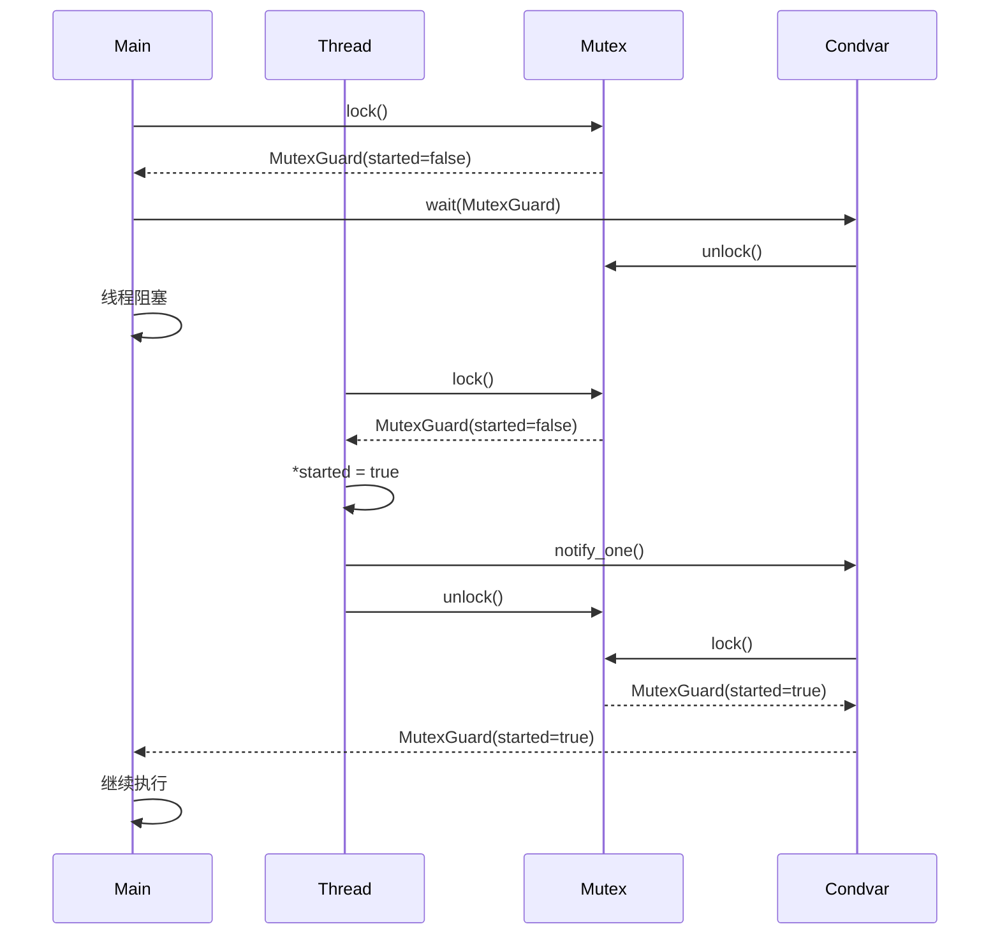

下面是添加了详细注释的代码，按行解释每个问题和相关概念：

```rust
use std::sync::{Arc, Mutex, Condvar};  // 导入同步原语：原子引用计数、互斥锁和条件变量
use std::thread;                        // 导入线程模块

fn main() {
    // Q1: 为什么使用Arc? 为什么用元祖包装？Mutex和Condvar的new方法是在栈上创建还是堆上？
    // 使用Arc的原因：需要在多个线程间安全地共享pair变量（包括Mutex和Condvar）
    // 使用元组包装的原因：将Mutex和Condvar绑定在一起，确保它们操作的是同一组数据
    // Mutex和Condvar的new方法：在栈上创建Mutex和Condvar实例（但内部数据存储在堆上）
    let pair = Arc::new((Mutex::new(false), Condvar::new()));
    let pair2 = pair.clone();  // 克隆Arc，增加引用计数，允许多个线程持有所有权

    thread::spawn(move || {
        // Q2: 此处捕获的外部变量pair2是获得所有权了吗？后续的Pair2将失效对吗？
        // 是的，通过move关键字，闭包获得了pair2的所有权
        // 闭包执行期间，原作用域无法再使用pair2（但原pair仍可在主线程使用）
        
        // Q3: 此处的pair2是个智能指针，为什么不能自动解引用为(Mutex::new(false),Condvar::new())？
        // Rust的自动解引用只发生在方法调用和操作符重载时，模式匹配（如let绑定）不会自动解引用
        // 需要显式使用*操作符解引用
        
        // Q4：*pair2 是(Mutex::new(false),Condvar::new()) 还是&(Mutex::new(false),Condvar::new())？请从内存图上解释
        // *pair2 是 (Mutex<bool>, Condvar) 元组值
        // 内存布局：Arc在栈上存储指向堆的指针，*pair2解引用后获得堆上的元组数据
        let (lock, cvar) = &*pair2;
        
        // Q5: lock()方法是什么意思？有什么用？如何处理异常？返回值是引用吗？
        // lock()方法尝试获取Mutex的锁
        // 作用：确保同一时间只有一个线程可以访问Mutex保护的数据
        // 异常处理：如果Mutex被毒化（poisoned，即持有锁的线程panic），返回Err
        // 返回值：MutexGuard类型，是一个智能指针，实现了Deref和DerefMut，可解引用为内部数据
        let mut started = lock.lock().unwrap();
        println!("changing started");
        
        // Q6：此处的started是什么类型？
        // started是MutexGuard<bool>类型，通过Deref可解引用为bool
        *started = true;
        
        // Q7:cvar是什么类型？调用方法时会自动解引用吗？
        // cvar是&Condvar类型（从元组中解构出来的引用）
        // 调用方法时会自动解引用，因为Condvar的方法接收self、&self或&mut self
        cvar.notify_one();  // 唤醒一个等待在该条件变量上的线程
    });

    let (lock, cvar) = &*pair;  // 主线程解构Arc中的元组
    let mut started = lock.lock().unwrap();  // 主线程获取锁
    
    // Q8: 下面的代码中，cvar为什么有wait方法？
    // Condvar提供wait方法，用于在条件不满足时释放锁并阻塞线程
    // 当其他线程调用notify_one/notify_all时，被阻塞的线程会被唤醒并重新获取锁
    while !*started {
        started = cvar.wait(started).unwrap();
    }
    println!("started changed");
}
```

### 关键点详解：

1. **内存布局与Arc的作用**
   - **栈内存**：
     - 主线程：pair（Arc指针）、pair2（Arc克隆指针）
     - 子线程：闭包捕获的pair2（Arc指针）
   - **堆内存**：
     - (Mutex<bool>, Condvar) 元组
     - Mutex内部：锁状态和bool值
     - Condvar内部：等待线程队列

2. **Mutex和Condvar的协作**
   - **Mutex**：提供独占访问，确保同一时间只有一个线程可以修改`started`
   - **Condvar**：允许线程在条件不满足时挂起，等待条件满足时被唤醒
   - **协作流程**：
     1. 主线程获取锁，检查条件（`!*started`）
     2. 条件不满足，调用`wait`释放锁并阻塞
     3. 子线程获取锁，修改条件（`*started = true`）
     4. 子线程调用`notify_one`唤醒等待线程
     5. 主线程被唤醒，重新获取锁，检查条件（此时条件满足）

3. **类型系统与自动解引用**
   - **MutexGuard**：
     - 实现了`Deref<Target = bool>`和`DerefMut`
     - 允许通过`*started`直接访问内部的bool值
   - **Condvar**：
     - 方法接收`&self`参数
     - 可通过引用直接调用（如`cvar.notify_one()`）

4. **异常处理**
   - `lock().unwrap()`：处理Mutex可能的毒化异常
   - `wait(started).unwrap()`：处理条件变量等待过程中的异常

### 执行流程可视化：



这个流程图展示了主线程和子线程如何通过Mutex和Condvar协作：
1. 主线程获取锁，发现条件不满足，调用wait释放锁并阻塞
2. 子线程获取锁，修改条件，通知条件变量
3. 主线程被唤醒，重新获取锁，继续执行
